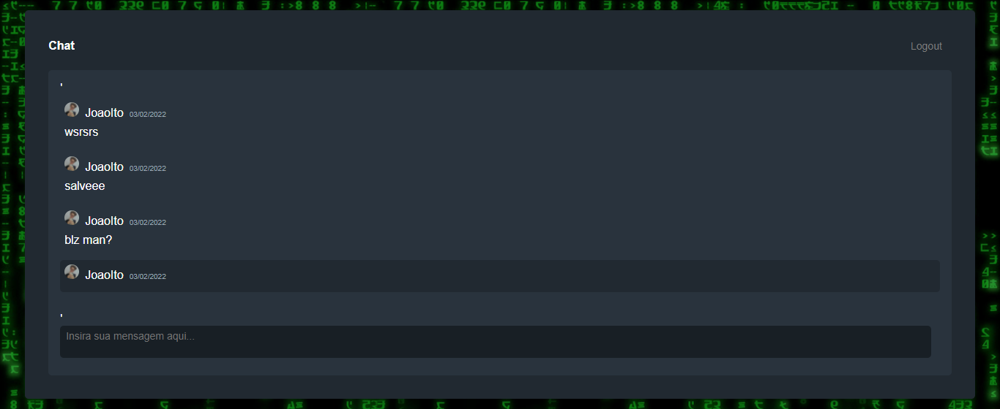

# AluraCord 🖥️

*Nestas aulas de React começaremos a fazer a nossa área de login no *Aluracord! E você vai colocá-la no ar!**

*Nesta aula vamos criar tudo do ZERO: desde o package.json até os arquivos bases do Next.js para iniciar nosso projeto e ter o CSS in JS com styled-jsx para cuidar da camada de estilo da nossa aplicação, duas ferramentas essenciais do mundo React. Também entenderemos como React se tornou tão popular no mercado de tecnologia e como iniciar o nosso aprendizado com a tecnologia.*

## *Conteúdo detalhado desta aula*

- Iniciaremos um projeto Next.js;
- Criaremos components com React usando CSS in JS;
- Vamos ver a estrutura inicial de um projeto Next.js;
- Passaremos propriedades para components;
- Faremos deploy do seu Aluracord na Vercel.

## *Preview*

### *Log🧑🏼‍💻*

### *Chat page*

---
